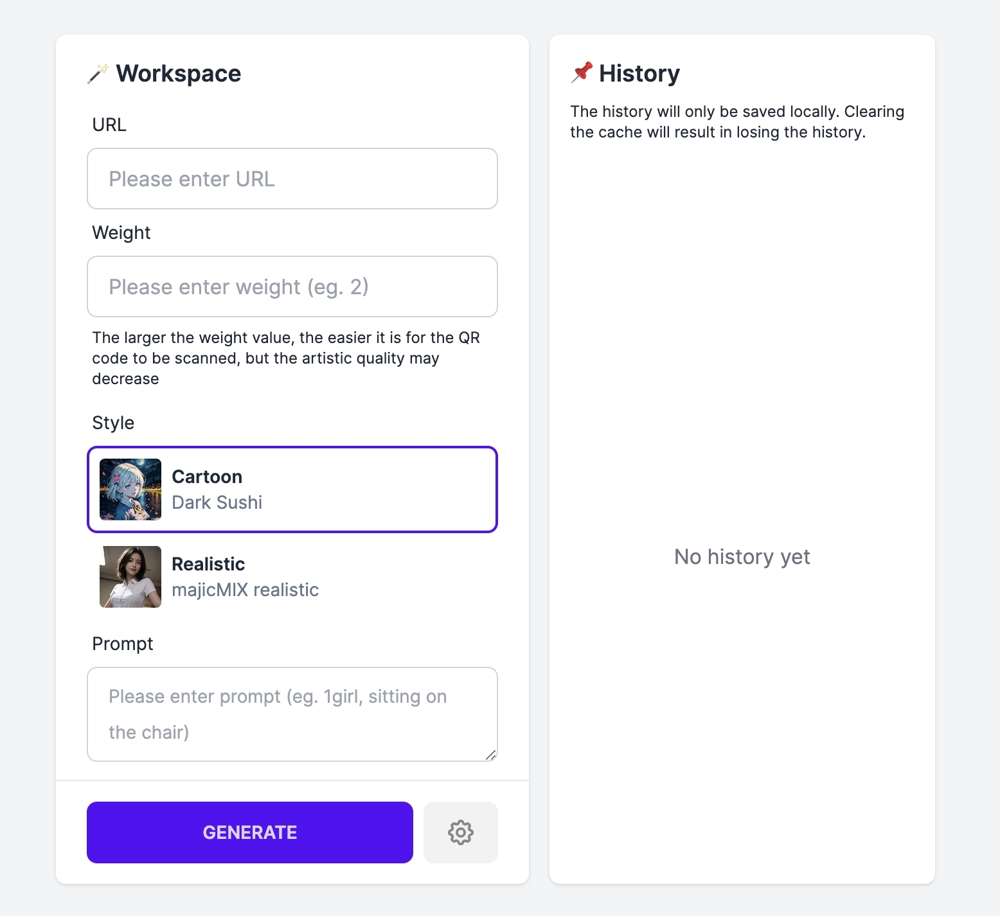

# tams gen qrcode example

This is an example for demonstrating how to use TAMS SDK. We have leveraged the capabilities of the TAMS SDK to create an Web App that can generate QR codes based on prompts.



You can visit this [website](https://tams-gen-qrcode-example-git-main-zhuscat.vercel.app/) to see the demo.

## Environment Variables

#### `TAMS_PRIVATE_KEY` (required)

Your TAMS private key after base64 encoding.

You can generate it by following command:

```
cat ./YOUR_PRIVATE_KEY_PATH | base64
```

#### `APP_SECRET` (required)

Access password. Users can use your Web App after entering secret.

## Development

Before you `npm run dev`, you should create a `.env.local` file containing `TAMS_PRIVATE_KEY` and `APP_SECRET`

```
$ git clone git@github.com:Tensor-Art/tams-gen-qrcode-example.git
$ cd tams-gen-qrcode-example
$ npm install
$ npm run dev
```

## Deploy

You can deploy your own instance by clicking deploy button [](https://vercel.com/new/clone?repository-url=https%3A%2F%2Fgithub.com%2FTensor-Art%2Ftams-gen-qrcode-example&env=TAMS_PRIVATE_KEY,APP_SECRET)
